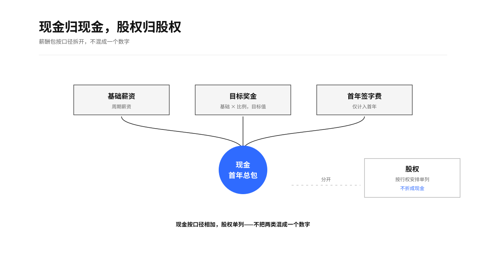
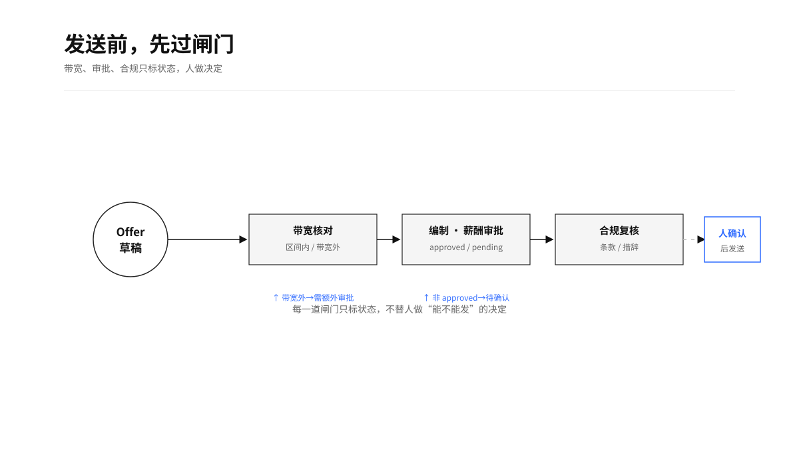
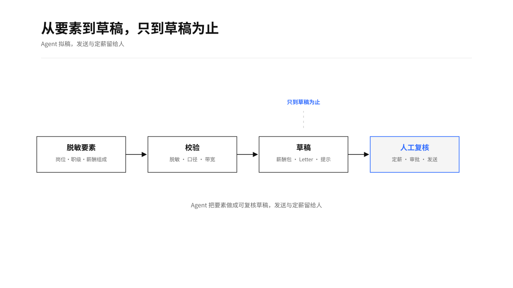
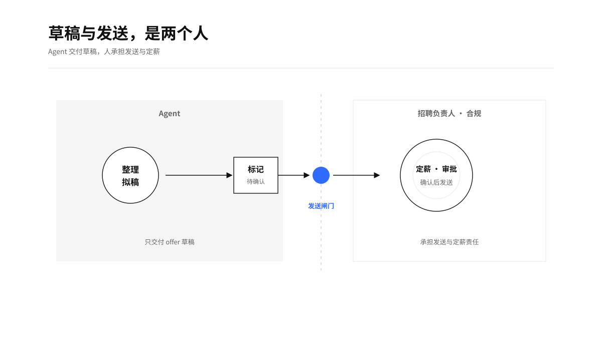

# Offer 起草

<p align="center">
  
  
  =3.8">
  
</p>

`hr-offer-drafter`

一个可本地运行、可复核、面向所有 Agent 的中文 offer 起草 Skill。它从脱敏的 offer 要素生成薪酬包口径、录用条款、占位 offer letter 正文、给招聘经理的谈判提示和发送前的待确认队列；飞书或 HRIS 只是可选只读输入源。它只产草稿，不代发 offer。

## 价值与适用场景

offer 阶段最容易出问题的地方有两个：不同口径的钱被加成一个数字，以及草稿被当成可以直接发送的定稿。这个 Skill 把基础薪资、目标奖金、签字费和股权按固定口径拆开，把带宽位置和审批状态标清楚，帮助 HR、招聘经理和薪酬团队围绕同一份草稿讨论。

适用于候选人进入 offer 阶段的薪酬包组装、offer letter 正文起草、谈判提示准备，以及发送前的带宽与审批核对。它不需要飞书接口，本地表格、文件、邮件、消息或 HR 提供的材料都可以作为输入。

<p align="center">
  
</p>

## 这个 Skill 产出什么

- 岗位、职级、地点、货币、周期与材料来源时效。
- 薪酬包：基础薪资、目标奖金、签字费、现金首年总包，股权单独列出。
- offer 基础薪资的 compa-ratio、range penetration 和带宽位置（提供带宽时）。
- 占位 offer letter 正文草稿，标注需人工与合规复核后发送。
- 给招聘经理的谈判提示，分清事实、带宽上下文与待确认项。
- 缺带宽、带宽外、缺编制/薪酬/法务审批等发送前待确认队列。

<p align="center">
  
</p>

## Agent 使用须知

本 Skill 适用于所有能读取 `SKILL.md`、处理用户授权材料并执行本地 Python 的 Agent。Agent 先确认岗位、职级、地点、薪酬口径、带宽与审批状态和材料时效；优先使用用户当前消息与本地脱敏材料；外部系统只在用户明确要求时只读接入。

默认只读、只产草稿。发送 offer、写回 ATS 状态、创建审批或修改 HRIS 都不在本 Skill 范围内。完整运行契约见 [AGENT-GUIDE.md](AGENT-GUIDE.md)。

## 快速开始

### 使用仓库中的虚构脱敏数据

```bash
python3 scripts/build_offer_draft.py \
  --input tests/fixtures/senior-engineer-offer.json \
  --format markdown \
  --output /tmp/offer-draft.md
```

### 使用本地或用户提供的材料

先将材料归一化成脱敏 JSON，再生成草稿包：

```bash
python3 scripts/build_offer_draft.py \
  --input /path/to/anonymized-offer.json \
  --format json \
  --output /tmp/offer-draft.json
```

字段定义见 [输入结构](references/input-schema.md)，薪酬口径见 [薪酬包口径](references/offer-components.md)。

### 使用飞书材料（可选）

```bash
lark-cli auth status --json --verify
lark-cli sheets +cells-get --url "https://example.feishu.cn/sheets/shtXXXX" \
  --sheet-name "脱敏薪酬带宽" --range "A1:Z200" --include value,formula --as user --json
```

飞书只用于读取用户明确授权的脱敏带宽或审批状态表。没有飞书接口时，直接使用本地或用户提供材料即可。

## 如何看结果

现金首年总包 = 基础薪资 + 目标奖金金额 + 首年签字费；它只是沟通口径，不代表到手金额或长期年化收入。股权按行权安排单独列出，不折算成现金。

带宽外、缺编制/薪酬/法务审批、口径不清都会进入待确认队列。它们是发送前需要人确认的信号，不能自动变成“可以发送”的结论。

<p align="center">
  
</p>

## 安全边界

- 默认只处理匿名 `candidate_ref`、岗位、职级、地点、薪酬组成和条款。
- 不处理姓名、联系方式、受保护属性、家庭、健康、薪酬历史或原始简历。
- 只产 offer 草稿，不代发、不写回 ATS、不创建或代替审批。
- offer letter 正文使用占位主体，标注需人工与合规复核后发送。
- 最终定薪、编制与合规审批、向候选人发送 offer 由有权限的人类负责人承担。

<p align="center">
  
</p>

## 验证

```bash
python3 -m unittest discover -s tests -p 'test_*.py'
python3 scripts/render_boards.py
```

## 上游与许可证

本项目以 [Anthropic Human Resources Plugin](https://github.com/anthropics/knowledge-work-plugins/tree/658e077ffd7bdd50a12c19ec5ff36fe34c88be8a/human-resources) 的 `draft-offer` 为上游参考。差异和许可证见 [UPSTREAM.md](UPSTREAM.md)。
